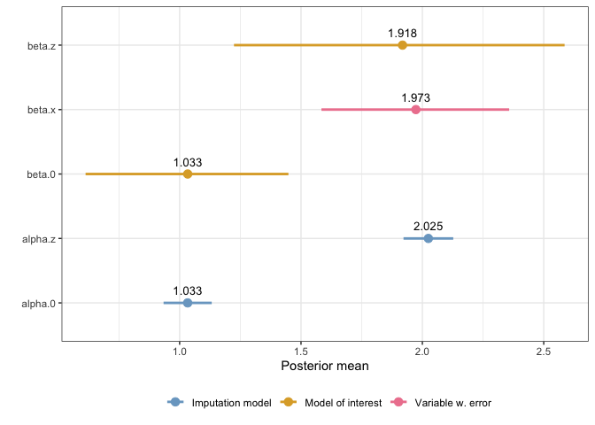

<!-- README.md is generated from README.Rmd. Please edit that file -->
<!-- Build rd-file with devtools::build_readme() -->

# inlami <a href='https://github.com/emmaSkarstein/inlami'></a>

<!-- badges: start -->

[](https://github.com/emmaSkarstein/inlami/actions/workflows/R-CMD-check.yaml)
<!-- badges: end -->

> :warning: **NOTE** The package is still under development, and some
> important functionality is still missing. Feel free to get in touch if
> you would like to use the package, but would like to know more about
> it’s current limitations.

Fitting measurement error models and missing data imputation models in
INLA is not trivial, and requires several workarounds in order to fit
the model. At the same time, a Bayesian hierarchical framework is very
attractive for modeling these types of data, since the hierarchical
model structure alllows us to describe how the data were collected, and
any errors they may have, through the model specification. By supplying
informative priors, we may be able to adjust for biases due to these
errors, and propagate any uncertainty they cause. Until recently, it has
been complicated to implement these kinds of models in R-INLA. This
package provides a helpful interface that makes measurement error and
missing data modelling in R-INLA much more feasible.

## Installation

You can install the development version of inlami from
[GitHub](https://github.com/) with:

``` r
# install.packages("devtools")
devtools::install_github("emmaSkarstein/inlami")
```

## When should I use this package?

This package is designed for fitting models where you have one covariate
that has classical measurement error, Berkson measurement error, missing
observations, or any combination of these three. That could mean that
you only have missing data, and if so this package can do missing data
imputation.

The model itself must be of the class of models that is possible to fit
with R-INLA. That means that it can be used for most common regression
types, like linear regression and logistic regression, and you can
include as many error free covariates as needed. You can also include
random effects, the same way as you would normally include such effects
in R-INLA.

The package is unfortunately not able to adjust for measurement error or
missingness in multiple covariates, though this could be implemented, it
just hasn’t yet. Feel free to get in touch if that is functionality that
would be of interest for your research!

## How can I use this package?

The dataset `simple_data` is included in the package, and is a very
simple simulated data set, used to illustrate the package. In this data
set, we have a response variable $y$, an error free covariate $z$, and a
covariate that is observed with classical error, Berkson error and
missingness, called $x$. We wish to fit the model

$$
 y = \beta_0 + \beta_x x + \beta_z z + \varepsilon \ ,
$$

but adjusting for all the errors in $x$.

First load the package:

``` r
library(inlami)
```

Next, we need to specify the formula for the main model and the formula
for the imputation model. This is done in the standard way in *R*:

``` r
main_formula <- y ~ x + z
```

For the imputation model, we take advantage of any correlation between
$x$ and the error free covariate $z$, so the imputation model will be

$$
 x = \alpha_0 + \alpha_z z + \varepsilon_x \ .
$$

We write that as

``` r
imputation_formula <- x ~ z
```

When adjusting for measurement error, we are completely dependent on
having some information about the measurement error variaces
$\sigma_{u_c}^2$ (for the classical error) and $\sigma_{u_b}^2$ (for the
Berkson error), since the size of this variance will affect how the
estimates are biased. We can gain information about these variances in a
few different ways, if repeated measurements have been made then these
can be put directly into the model to estimate the error variance, or if
we have some expert knowledge about the error size, then that can be
used to specify an informative prior for the variance (or precision,
since in INLA the precision is used, rather than the variance).

In this case, since we have in fact simulated the data ourselves, we
know that the error variances are in both cases close to 1, so we
specify priors that have modes at 1.

In the `fit_inlami` function we also need to specify the likelihood for
the model of interest, which in this case is Gaussian.

``` r
simple_model <- fit_inlami(formula_moi = main_formula,
                           formula_imp = imputation_formula,
                           family_moi = "gaussian",
                           data = simple_data, 
                           error_type = c("classical", "berkson", "missing"),
                           prior.prec.y = c(10, 9),
                           prior.prec.u_b = c(10, 9),
                           prior.prec.u_c = c(10, 9),
                           prior.prec.r = c(10, 9),
                           initial.prec.y = 1,
                           initial.prec.u_b = 1,
                           initial.prec.u_c = 1,
                           initial.prec.r = 1)
#> The legacy packages maptools, rgdal, and rgeos, underpinning the sp package,
#> which was just loaded, will retire in October 2023.
#> Please refer to R-spatial evolution reports for details, especially
#> https://r-spatial.org/r/2023/05/15/evolution4.html.
#> It may be desirable to make the sf package available;
#> package maintainers should consider adding sf to Suggests:.
#> The sp package is now running under evolution status 2
#>      (status 2 uses the sf package in place of rgdal)
```

Once we have fit the model, we can view the summary:

``` r
summary(simple_model)
#> Fixed effects for model of interest: 
#>            mean        sd 0.025quant 0.5quant 0.975quant     mode          kld
#> beta.0 1.031288 0.2182262   0.607848 1.030313   1.449727 1.013496 1.181286e-07
#> beta.z 1.914097 0.3879392   1.187159 1.907715   2.616672 1.910104 1.014903e-04
#> 
#> Coefficient for error prone variable: 
#>            mean        sd 0.025quant 0.5quant 0.975quant     mode
#> beta.x 1.967574 0.1873602   1.594241 1.969018   2.333466 1.974462
#> 
#> Fixed effects for imputation model: 
#>             mean         sd 0.025quant 0.5quant 0.975quant     mode
#> alpha.0 1.033076 0.05060075  0.9337947 1.033083   1.132313 1.033099
#> alpha.z 2.024717 0.05226267  1.9222465 2.024700   2.127284 2.024667
#>                  kld
#> alpha.0 2.384838e-12
#> alpha.z 1.040559e-11
#> 
#> Model hyperparameters (apart from beta.x): 
#>                                                 mean        sd 0.025quant
#> Precision for the Gaussian observations    1.1245683 0.3351916  0.5843459
#> Precision for the Gaussian observations[2] 1.1050378 0.3131168  0.6106247
#> Precision for the Gaussian observations[3] 0.9282395 0.1044870  0.7402968
#> Precision for the Gaussian observations[4] 0.9744697 0.1186832  0.7605170
#>                                             0.5quant 0.975quant      mode
#> Precision for the Gaussian observations    1.0858233   1.892886 1.0133511
#> Precision for the Gaussian observations[2] 1.0645916   1.835945 0.9887091
#> Precision for the Gaussian observations[3] 0.9220227   1.151868 0.9091415
#> Precision for the Gaussian observations[4] 0.9676896   1.227926 0.9548077
```

And we can use the default plot function to see a plot of the fixed
effects:

``` r
plot(simple_model)
```


